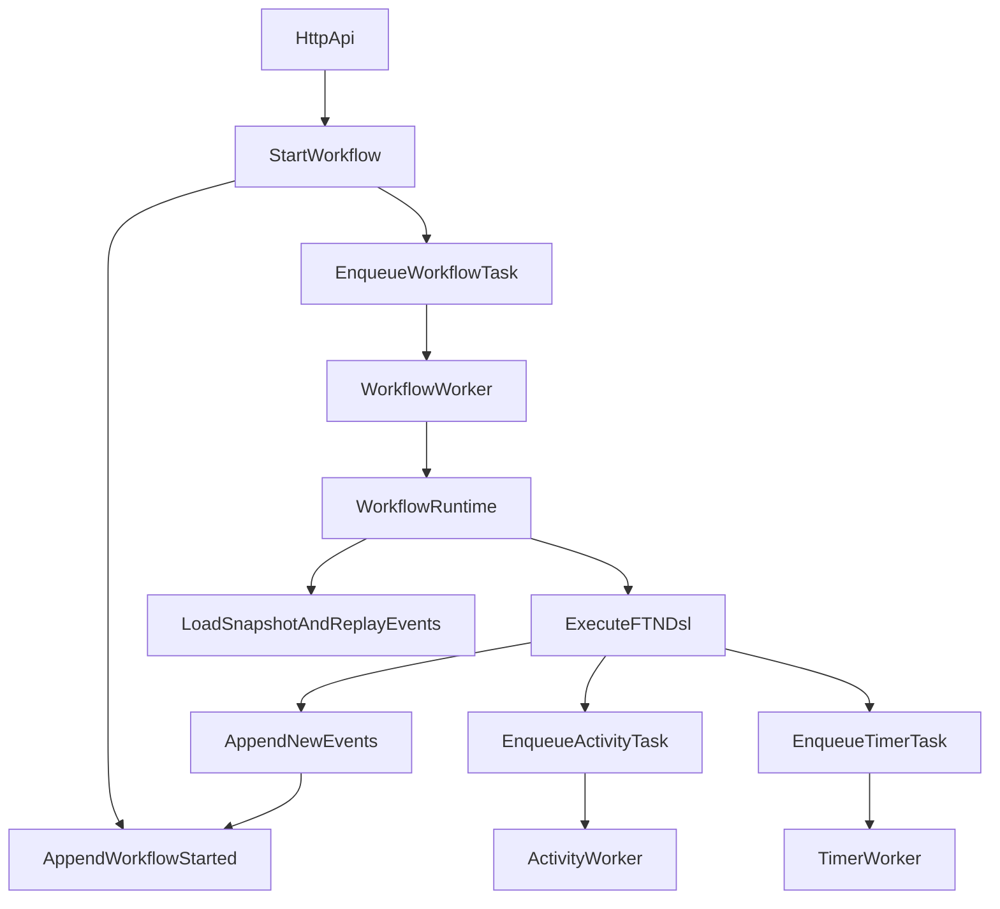

# FTN Workflow Engine

FTN es un motor de workflows determinista en TypeScript orientado a backend platform engineering. Combina event sourcing, snapshots, workers desacoplados y un DSL explícito para ejecutar procesos largos, auditables y recuperables, con persistencia opcional en Postgres y colas en Redis.

## Elevator pitch

FTN aborda un problema clásico en sistemas distribuidos: cómo ejecutar procesos largos sin depender de memoria efímera ni perder trazabilidad. En lugar de guardar solo el estado final, cada transición relevante del workflow se persiste como evento. Eso permite:

- replay reproducible
- recuperación tras caída de workers o reinicios
- auditoría de runs y debugging más fino
- separación clara entre core determinista e infraestructura

## Qué incluye hoy

El proyecto ya no es solo una idea o skeleton. A día de hoy incluye:

- motor determinista en `src/core`
- runtime y workers para workflows, activities y timers
- persistencia dual:
  - in-memory para desarrollo rápido
  - Postgres para event store y snapshot store
- cola dual:
  - in-memory
  - Redis con recuperación de leases huérfanos
- API HTTP con auth, catálogo, runs, señales, credenciales, métricas y docs
- frontend con pantallas de login, workflows, catálogo, designer y credenciales
- suite de tests unitarios e integración
- documentación de arquitectura, producción, benchmarks e integraciones

## Mejoras implementadas recientemente

### Hardening del motor

Durante los últimos sprints se reforzaron varias garantías operativas:

- snapshots + replay validados con tests de regresión
- observabilidad mínima en runtime y workers
- conflictos de concurrencia visibles mediante `ConcurrencyError`
- cancelación explícita con limpieza de pendientes
- tenancy base con `tenantId` y cuota de runs concurrentes
- extracción parcial del arranque HTTP para reducir acoplamiento

### Nuevas capacidades del DSL/runtime

Actualmente FTN soporta:

- `ftn.activity()`
- `ftn.parallel()`
- `ftn.join()`
- `ftn.retry()`
- `ftn.sleep()`
- `ftn.signal()`
- `ftn.child()`
- `ftn.forEach()`
- `ftn.workflowId()`
- `ftn.runId()`

### Versionado real de workflows

Se incorporó soporte real para versiones de workflow:

- el catálogo ya soporta múltiples versiones del mismo workflow
- cada run persiste `workflowVersion` en `WorkflowStarted`
- el runtime reanuda usando `name + version`, no solo `name`
- runs antiguos pueden seguir funcionando aunque se publique una versión nueva
- si una versión requerida no existe, el runtime falla de forma explícita y observable

Esto reduce un riesgo importante: reanudar un run histórico con una definición distinta a la original.

## Principios de diseño

- **Event sourcing como fuente de verdad**: el historial de eventos manda
- **Snapshots periódicos**: aceleran rehidratación sin perder replay completo
- **Workers desacoplados**: mejor escalado horizontal y operación distribuida
- **DSL explícita**: los side effects pasan por FTN para mantener determinismo
- **Persistencia/cola intercambiables**: buena DX local sin renunciar a despliegue más robusto

## Invariantes operativas importantes

El motor intenta preservar estas reglas:

- un run no debe depender de memoria local para poder reconstruirse
- `snapshot + eventos posteriores` debe producir el mismo estado que el replay completo
- un conflicto de append concurrente debe ser explícito, no silencioso
- un run terminal no debe volver a `running`
- cancelación debe limpiar pendientes
- la observabilidad debe seguir el flujo real del run

Más detalle en `docs/ENGINE_INVARIANTS.md`.

## Arquitectura

Capas principales:

- `src/core`: engine, eventos, estado, replay y DSL `ftn`
- `src/modules`: contratos del runtime/event store/task queue + activity runtime + integraciones
- `src/infra`: implementaciones concretas de HTTP, Postgres, Redis, logger, metrics y bootstrap
- `src/workers`: workers de ejecución
- `src/app`: catálogo de workflows, designer, scheduler y triggers
- `src/shared`: tipos y utilidades comunes

Flujo de ejecución de un run:



Resumen más corto en `docs/ARCHITECTURE.md`.

## Estado actual del backend

### Core

- eventos y estado serializable
- replay determinista
- snapshots
- manejo de retries, señales, timers y child workflows

### Workers

- workflow worker
- activity worker
- timer worker
- reintentos por conflicto de concurrencia

### Persistencia

- `inmemory-*` para local/dev
- `postgres-event-store`
- `postgres-snapshot-store`
- migraciones de tablas del motor

### Queueing

- cola in-memory
- `redis-task-queue`
- recuperación de leases estancados

### Observabilidad

- logger estructurado
- endpoint `GET /metrics`
- métricas de HTTP y del motor
- contadores de snapshots, appends, conflictos, dequeues y rehidratación
- base lista para seguir creciendo con OpenTelemetry

## API HTTP destacada

FTN ya expone endpoints útiles para operar el sistema:

- `GET /health`
- `GET /ready`
- `GET /metrics`
- `GET /docs`
- `GET /openapi.json`
- `POST /auth/login`
- `POST /auth/register`
- `GET /auth/status`
- `POST /auth/refresh`
- `POST /auth/logout`
- `GET /workflows`
- `POST /workflows`
- `GET /workflows/:workflowId/:runId`
- `GET /workflows/:workflowId/:runId/events`
- `GET /workflows/:workflowId/:runId/steps`
- `POST /workflows/:workflowId/:runId/signals`
- `POST /workflows/:workflowId/:runId/cancel`
- `GET /activities`
- `GET /catalog/workflows`
- `GET|POST|PUT /designer/workflows...`
- `GET|PUT /credentials/:provider`

## Catálogo y versionado de workflows

Reglas actuales:

- cada workflow publica `version` explícita
- el catálogo soporta varias versiones del mismo `name`
- iniciar sin versión explícita usa la última versión registrada
- cada run congela `workflowVersion` en `WorkflowStarted`
- reanudar un run resuelve por `name + version`
- si falta la versión requerida, el run falla de forma explícita

Recomendaciones:

- cambios compatibles: misma familia con incremento menor/parche
- cambios breaking: versión nueva clara, y mantener versiones históricas si hay runs vivos o replays que dependen de ellas

## Integraciones disponibles

Módulos registrados actualmente:

- `payments`
- `notifications`
- `identity`
- `http`
- `storage`
- `messaging`
- `documents`
- `logistics`
- `crm`

Ejemplos frecuentes:

- HTTP seguro con políticas de URL y timeouts
- Stripe para pagos
- SendGrid / Twilio / webhooks para notificaciones
- almacenamiento SQL/KV
- módulos de identidad, logística y CRM

Más detalle en `docs/integrations/INTEGRATIONS.md`.

## Requisitos

- Node.js `>= 20`
- npm `>= 9`

## Puesta en marcha rápida

### Backend

```bash
npm install
npm run build
npm start
```

### Frontend

```bash
cd frontend
npm install
npm run dev
```

### Entorno

Puedes usar `deploy/.env.example` como referencia para variables de entorno.

## Scripts útiles

Backend:

- `npm run build`: compila TypeScript a `dist`
- `npm test`: ejecuta build + tests backend principales
- `npm run test:integration`: integración con Postgres/Redis
- `npm run lint`: lint sobre `src`
- `npm run check:openapi`: validación rápida de OpenAPI
- `npm start`: arranca API + workers desde `dist/infra/main.js`

Frontend:

- `npm run dev`
- `npm run build`
- `npm run preview`
- `npm run test`

## Docker Compose

`docker-compose.yml` permite levantar un stack local reproducible:

- backend FTN
- frontend
- Postgres
- Redis

### Arranque

```bash
docker compose up --build
```

### Validación rápida

1. Abrir `http://localhost:8000/health`
2. Abrir `http://localhost:8000/ready`
3. Abrir `http://localhost:8000/docs`
4. Abrir frontend en `http://localhost:5173`
5. Consultar `http://localhost:8000/metrics`

### Operación básica

```bash
docker compose ps
docker compose logs -f
docker compose logs -f backend
docker compose restart backend
docker compose down
docker compose down -v
```

### Puertos configurables

- `FTN_BACKEND_PORT`
- `FTN_FRONTEND_PORT`
- `FTN_POSTGRES_PORT`
- `FTN_REDIS_PORT`

Ejemplo:

```bash
FTN_BACKEND_PORT=8010 FTN_FRONTEND_PORT=5174 FTN_POSTGRES_PORT=55433 FTN_REDIS_PORT=56380 docker compose up --build
```

## Estructura principal

```text
src/
  core/                # Engine, eventos, estado, replay, DSL FTN
  modules/             # Contratos, runtime e integraciones
  infra/               # HTTP, Postgres, Redis, metrics, logger, bootstrap
  workers/             # Workers de ejecución
  app/                 # Catálogo de workflows, triggers, designer, scheduler
  shared/              # Tipos y utilidades compartidas
  __tests__/           # Tests unitarios e integración
frontend/              # UI
docs/                  # Arquitectura, producción, benchmarks, integraciones
deploy/.env.example    # Referencia de configuración
```

## Tests y evidencia técnica

El repo incluye:

- tests unitarios del runtime, engine, workers y módulos
- tests de integración con Postgres
- tests de integración con Redis task queue
- escenarios de concurrencia con optimistic locking
- regresiones de snapshot/replay
- regresiones de versionado `v1/v2`

Plan de benchmarks en `docs/benchmarks/BENCHMARK_PLAN.md`.

## Producción y seguridad

Checklist rápida:

- definir `FTN_JWT_SECRET` y/o `FTN_API_KEY`
- configurar `FTN_CORS_ORIGINS`
- revisar límites HTTP y rate limiting
- monitorizar `/metrics`
- usar Postgres/Redis para escenarios no triviales
- revisar warnings del proceso en `NODE_ENV=production`

Más detalle en `docs/PRODUCTION.md`.

## Documentación adicional

- `docs/ARCHITECTURE.md`
- `docs/P4_DONE.md`
- `docs/ENGINE_INVARIANTS.md`
- `docs/WORKFLOW_VERSIONING.md`
- `docs/PRODUCTION.md`
- `docs/integrations/INTEGRATIONS.md`
- `docs/benchmarks/BENCHMARK_PLAN.md`
- `docs/INTERVIEW_PACK.md`
- `docs/GO_TO_MARKET_TEMPLATES.md`

## Roadmap cercano

Lo siguiente que tiene más sentido seguir reforzando:

1. integración Postgres específica para convivencia de varias versiones de workflows
2. más separación entre bootstrap y routing HTTP
3. más cobertura E2E de API y frontend
4. observabilidad más profunda con trazas distribuidas
5. evolución del versionado hacia políticas/migraciones más explícitas

