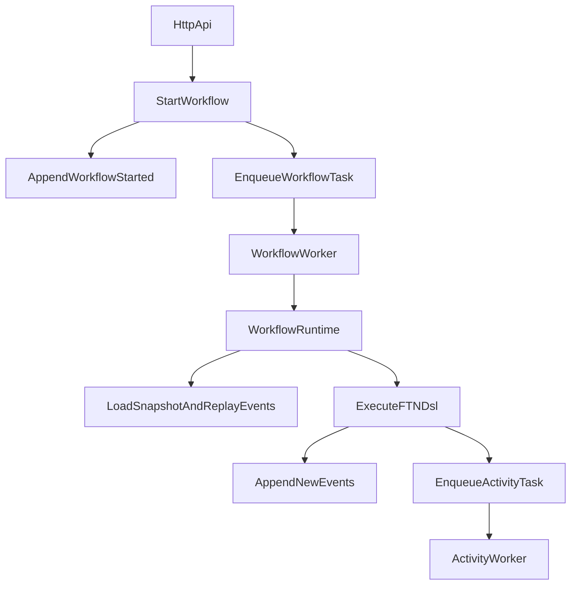

# FTN Workflow Engine

Motor de workflows determinista en TypeScript orientado a casos reales de backend platform engineering. FTN permite orquestar procesos con event sourcing, snapshots y workers, con persistencia opcional en Postgres/Redis y una UI para operar workflows.

## Elevator pitch (30s)

FTN resuelve un problema típico en sistemas distribuidos: ejecutar procesos largos y recuperables sin perder trazabilidad. En vez de depender de estado efímero, cada transición del workflow se persiste como evento; eso permite replay, auditoría y recuperación tras fallos de workers. El objetivo es priorizar determinismo, observabilidad y mantenibilidad.

## Qué problema resuelve

- Orquestación de workflows con pasos asíncronos y dependencias externas.
- Reanudación segura tras fallos de proceso o infraestructura.
- Trazabilidad por run para debugging y auditoría.
- Separación entre core determinista e integraciones de infraestructura.

## Decisiones técnicas y trade-offs

- **Event sourcing + snapshots**: trazabilidad y replay reproducible a cambio de mayor complejidad operativa y de modelado.
- **Workers + cola desacoplada**: mejora de escalabilidad horizontal, con coste en coordinación y manejo de leases/concurrencia.
- **Persistencia dual (memory/Postgres, queue memory/Redis)**: acelera desarrollo local y habilita despliegues más robustos, pero incrementa superficie de pruebas.
- **DSL FTN explícita**: acota side effects para mantener determinismo; reduce libertad de implementación ad hoc dentro del workflow.

## Why this is production-minded

- Concurrencia defensiva en event store con optimistic locking y tests de carrera.
- Readiness/health checks, rate limiting, autenticación y auditoría HTTP.
- CI con lint, build, tests unitarios e integración (Postgres + Redis).
- Deploy reproducible con Docker Compose.
- Diseño modular preparado para crecimiento de integraciones y separación futura de servicios.

## Estado actual del proyecto

Implementaciones en el repo a día de hoy:

- Core determinista (`src/core`): eventos, estado, replay, DSL `ftn` (`activity`, `join`, `parallel`, `retry`, `sleep`, `signal`, `workflowId`, `runId`).
- Runtime + workers (`src/infra`, `src/workers`): worker de workflows, worker de activities, worker de timers.
- Persistencia dual:
  - In-memory (`inmemory-*`) para desarrollo rápido.
  - Postgres (`postgres-event-store`, `postgres-snapshot-store`) + migraciones.
- Cola dual:
  - In-memory queue.
  - Redis queue (`redis-task-queue`) con recuperación de leases huérfanos.
- Integraciones modulares (`src/modules/integrations`): `payments`, `notifications`, `identity`, `http`, `storage`, `messaging`, `documents`, `logistics`, `crm`.
- API HTTP en `src/infra/main.ts` con:
  - Auth (`/auth/login`, `/auth/register`, `/auth/status`, `/auth/refresh`, `/auth/logout`, `POST /auth/forgot-password` stub 501)
  - Métricas Prometheus texto en `GET /metrics`
  - Auditoría (`GET /audit/logs?limit=`) y tabla `ftn_audit_log` (Postgres)
  - Workflows/runs (`/workflows`, detalle, eventos, señales)
  - Designer (`/designer/workflows`, `/designer/kinds`)
  - Credenciales por usuario (`/credentials/*`)
  - Catálogo (`/activities`, endpoints de catálogo)
  - Salud y docs (`/health`, `/ready`, `/openapi.json`, `/docs`)
- Frontend con páginas de login, workflows, catálogo, designer y credenciales.
- OpenAPI disponible en `docs/api/openapi.json` (validación rápida: `npm run check:openapi`).
- Anexos extendidos (opcional): `docs/integrations/INTEGRATIONS.md`, `docs/WORKFLOW_VERSIONING.md`, `docs/PRODUCTION.md`, `docs/ARCHITECTURE.md`, `docs/INTERVIEW_PACK.md`.
- Suite de tests unitarios + integración en `src/__tests__`.

## Requisitos

- Node.js `>= 20`
- npm `>= 9`

## Configuración rápida

1. Instala dependencias del backend:

```bash
npm install
```

1. (Opcional) configura entorno copiando `deploy/.env.example` a `.env` y ajustando variables.
2. Compila y ejecuta backend:

```bash
npm run build
npm start
```

1. Frontend (opcional, en otra terminal):

```bash
cd frontend
npm install
npm run dev
```

## Scripts útiles

Backend (`package.json` raíz):

- `npm run build`: compila TypeScript a `dist`.
- `npm test`: tests principales.
- `npm run test:integration`: batería de integración (Postgres/Redis).
- `npm run lint`: lint sobre `src`.
- `npm start`: arranca API + workers desde `dist/infra/main.js`.

Frontend (`frontend/package.json`):

- `npm run dev`
- `npm run build`
- `npm run preview`

## Deploy reproducible (Docker Compose)

`docker-compose.yml` levanta stack completo en local:

- Backend FTN (`http://localhost:8000` por defecto)
- Frontend (`http://localhost:5173` por defecto)
- Postgres (`localhost:55432` por defecto)
- Redis (`localhost:56379` por defecto)

### Arranque

```bash
docker compose up --build
```

### Validación rápida

1. Abre `http://localhost:8000/health`.
2. Abre `http://localhost:8000/ready` y verifica `status: "ready"`.
3. Abre frontend en `http://localhost:5173`.
4. Swagger UI en `http://localhost:8000/docs`.
5. Login demo:
   - usuario: `demo`
   - contraseña: `demo-password-123`

### Operación

```bash
docker compose ps
docker compose logs -f
docker compose logs -f backend
docker compose restart backend
docker compose down
docker compose down -v
```

### Troubleshooting rápido

- Si aparece `open //./pipe/dockerDesktopLinuxEngine: The system cannot find the file specified`, inicia Docker Desktop (engine Linux) y reintenta.
- Si aparece `500 Internal Server Error` hacia `dockerDesktopLinuxEngine` o `unable to get image ... json`, el motor de Docker va mal: reinicia Docker Desktop, comprueba `docker version`, y en caso extremo actualiza Docker Desktop o ejecuta `wsl --shutdown` (si usas WSL2) y reinicia.
- **`EADDRINUSE` ... `port: 4000` dentro del contenedor**: el backend ya está en marcha (`CMD` del `Dockerfile.backend`). No ejecutes otra vez `node dist/infra/main.js` con `docker exec` salvo que uses otro `PORT` o detengas el proceso que escucha. Para ver logs usa `docker logs ftn-backend`; para una shell sin arrancar el servidor: `docker exec -it ftn-backend sh`.
- **`docker compose up --build frontend` recompila también el backend**: es normal si Compose considera que debe reconstruir dependencias. Para **solo** la imagen del frontend: `docker compose build frontend` y luego `docker compose up -d frontend`.
- **Build del frontend muy lento o `rpc error ... EOF`**: suele ser contexto Docker enorme (p. ej. sin `frontend/.dockerignore`) o Docker Desktop saturado. Cierra otras cargas, aumenta recursos en Docker Desktop, y reintenta; el repo incluye `frontend/.dockerignore` para excluir `node_modules` y `dist` del contexto.
- Valida que Docker esté operativo:

```bash
docker version
docker compose ps
```

### Puertos configurables

Puedes sobreescribir sin tocar el compose:

- `FTN_BACKEND_PORT` (por defecto `8000`, mapea a `container:4000`)
- `FTN_FRONTEND_PORT` (por defecto `5173`, mapea a `container:80`)
- `FTN_POSTGRES_PORT` (por defecto `55432`, mapea a `container:5432`)
- `FTN_REDIS_PORT` (por defecto `56379`, mapea a `container:6379`)

Ejemplo:

```bash
FTN_BACKEND_PORT=8010 FTN_FRONTEND_PORT=5174 FTN_POSTGRES_PORT=55433 FTN_REDIS_PORT=56380 docker compose up --build
```

## Estructura principal

```text
src/
  core/                # Engine, eventos, estado, DSL FTN
  modules/             # Contratos + activity runtime + integraciones
  infra/               # HTTP server, stores/queues concretos, workers infra
  workers/             # Worker de activities (core)
  app/                 # Catálogo de workflows, designer store/runtime, triggers
  shared/              # Tipos y utilidades compartidas
  __tests__/           # Tests unitarios e integración
frontend/              # UI en Preact (designer, catálogo, runs, auth, credentials)
docs/api/openapi.json  # Especificación OpenAPI
deploy/.env.example    # Variables de entorno de referencia
```

## Endpoints destacados

- `GET /health`
- `GET /ready`
- `GET /docs`
- `GET /openapi.json`
- `POST /auth/login`
- `POST /auth/register`
- `GET /workflows`
- `POST /workflows`
- `POST /workflows/:workflowId/:runId/signals`
- `GET|POST|PUT /designer/workflows...`
- `GET|PUT /credentials/:provider`

## Benchmarks y evidencia técnica

Plan y metodología:

- `docs/benchmarks/BENCHMARK_PLAN.md`
- `docs/benchmarks/RESULTS.md`

Resumen de referencia (muestra inicial):

| Escenario | Lote | Concurrencia | Throughput (runs/s) | p50 | p95 | p99 | Success % |
|---|---:|---:|---:|---:|---:|---:|---:|
| In-memory | 500 | 25 | 120 | 80ms | 150ms | 210ms | 100 |
| Postgres + Redis | 500 | 25 | 42 | 210ms | 490ms | 740ms | 99.8 |
| Postgres + Redis + recovery | 500 | 25 | 38 | 240ms | 620ms | 900ms | 99.6 |

Cómo reproducir:

1. Levanta infraestructura: `docker compose up --build -d`.
2. Compila backend: `npm run build`.
3. Arranca API/workers: `npm start`.
4. Ejecuta pruebas/cargas y registra resultados en `docs/benchmarks/RESULTS.md`.

## Arquitectura (resumen en README)

Capas principales:

- `src/core`: motor determinista, eventos, replay, DSL `ftn`.
- `src/modules`: contratos del runtime/event store/task queue + integraciones.
- `src/infra`: implementaciones concretas (HTTP, Postgres, Redis, logger).
- `src/workers`: ejecución de colas de workflow/activity/timer.
- `src/app`: catálogo de workflows, designer, scheduler y triggers.

Flujo de ejecución de un run:



Trade-offs principales:

- Event sourcing + snapshots: más complejidad, pero mucha trazabilidad y recuperación fiable.
- Workers desacoplados: mejor escalado horizontal, mayor coste de coordinación y observabilidad.
- Persistencia dual: muy útil para DX y demo, exige más disciplina de pruebas.

## Producción y seguridad (checklist rápido)

- Secretos: usar `FTN_JWT_SECRET` y/o `FTN_API_KEY` por entorno, nunca en git.
- CORS: definir `FTN_CORS_ORIGINS` explícito (evitar `*` con credenciales).
- Límites HTTP: `FTN_HTTP_MAX_BODY_BYTES` y `FTN_HTTP_RATE_LIMIT_PER_MINUTE`.
- Auth/RBAC: activar `FTN_ENABLE_RBAC` y scopes por usuario cuando aplique.
- Observabilidad: monitorizar `/metrics`, tasas `429`/`5xx`, latencia de workers y errores por integración.
- Runtime warnings: en `NODE_ENV=production`, el proceso avisa si faltan variables críticas.

## Versionado de workflows (reglas operativas)

- Cada descriptor de workflow debe publicar `version` explícita.
- Cada run guarda `workflowVersion` en `WorkflowStarted` para trazabilidad.
- Cambio compatible: incrementos menores/parche.
- Cambio breaking (input obligatorio, rename de actividades): versión mayor o `workflowName` nuevo (`orders.v2`).
- No hay migrador automático de streams: mantener workflows históricos para no romper replay.

## Integraciones (resumen práctico)

Módulos actualmente registrados: `payments`, `notifications`, `identity`, `http`, `storage`, `messaging`, `documents`, `logistics`, `crm`.

Ejemplos típicos:

- HTTP (`http.request:v1`): request a APIs externas con política de URL segura y timeouts.
- Payments (Stripe): checkout/session/status con credenciales `stripe`.
- Notifications: email (SendGrid), SMS (Twilio), webhook (Slack u otros).
- Storage: `db.execute`, `kv.put`, `kv.get`.
- CRM: `crm.upsertUser:v1`.

Flujo mínimo para probar una integración:

1. Verificar `GET /health` y `GET /ready`.
2. Consultar catálogo con `GET /activities`.
3. Arrancar run con `POST /workflows` usando `workflowName` + `input`.
4. Seguir estado/eventos con `GET /workflows/:workflowId/:runId` y `/events`.

## Pack de entrevista (incluido en README)

Narrativa sugerida en 5 minutos:

1. Problema: orquestación distribuida con poca trazabilidad.
2. Decisión: event sourcing + snapshots + workers desacoplados.
3. Garantías: concurrencia defensiva (`ConcurrencyError` + retries), API segura y CI sólida.
4. Resultado: replay reproducible, recuperación tras fallos y operación con métricas.
5. Roadmap: E2E, trazas distribuidas, modularización adicional de routing.

Guion demo 7-10 minutos:

1. `docker compose up --build`.
2. Mostrar `/health`, `/ready`, `/metrics`.
3. Ejecutar un workflow y consultar eventos.
4. Simular fallo de worker y enseñar recuperación.
5. Cerrar con decisiones + trade-offs + siguientes mejoras.

## Roadmap / mejoras siguientes

1. **Documentación funcional**: ampliar `docs/integrations/INTEGRATIONS.md` con payloads alineados al catálogo OpenAPI por actividad.
2. **Cobertura de tests**: E2E API + frontend; más escenarios multi-worker; propiedades de cola bajo carga.
3. **Observabilidad**: trazas distribuidas (OpenTelemetry) además de `GET /metrics` y el logger.
4. **Recuperación de contraseña**: sustituir el stub `501` en `POST /auth/forgot-password` por flujo con email seguro.
5. **OpenAPI**: regenerar o sincronizar automáticamente `docs/api/openapi.json` con los endpoints nuevos (`/metrics`, `/auth/*`, `/audit/logs`).

