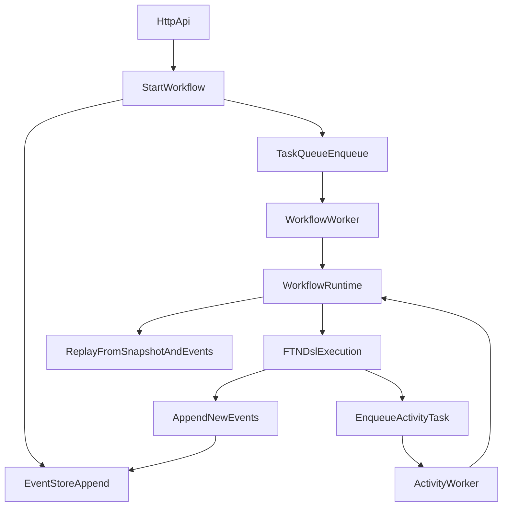

# FTN Architecture (One Pager)

## Objetivo de arquitectura

FTN busca ejecutar workflows de forma determinista y recuperable. El sistema separa claramente:

- Core de workflow (estado, eventos, replay, DSL).
- Runtime/Workers (orquestación y ejecución de tareas).
- Infraestructura (stores, colas, HTTP, credenciales).
- App layer (catálogo de workflows, designer, triggers).

## Componentes principales

- `src/core`: motor determinista, tipos de eventos y DSL `ftn`.
- `src/modules`: contratos de runtime/event store/task queue e integraciones.
- `src/infra`: implementaciones concretas (Postgres, Redis, HTTP, logger).
- `src/workers`: workers de ejecución.
- `src/app`: workflows de negocio, designer y scheduling.

## Flujo de datos (alto nivel)

## Decisiones y razones

1. **Event sourcing como fuente de verdad**
   - Permite auditoría y reconstrucción exacta de runs.
   - Facilita depuración de escenarios complejos por historial de eventos.

2. **Snapshots periódicos**
   - Reduce coste de rehidratación para runs largos.
   - Mantiene replay completo posible cuando se necesita análisis profundo.

3. **Concurrencia con optimistic locking**
   - Evita escrituras perdidas en ejecución multi-worker.
   - Hace explícitos los conflictos mediante `ConcurrencyError`.

4. **Queue abstraída**
   - In-memory para desarrollo rápido.
   - Redis para resiliencia y operación multi-proceso.

## Riesgos conocidos y mitigaciones

- **Riesgo**: archivo de entrada HTTP muy grande (`main.ts`) complica evolución.
  - **Mitigación**: extracción gradual de routers por dominio.
- **Riesgo**: drift entre endpoints y OpenAPI.
  - **Mitigación**: validación más estricta del spec y tests de contrato.
- **Riesgo**: integraciones externas inestables.
  - **Mitigación**: timeouts, retries y validaciones de credenciales/config.

## Evolución recomendada

- Mayor separación de bootstrap vs routing.
- Trazas distribuidas (OpenTelemetry).
- Cobertura E2E API y escenarios de fallos de infraestructura.
